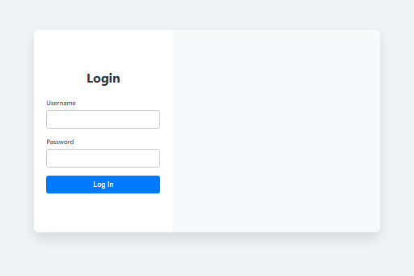
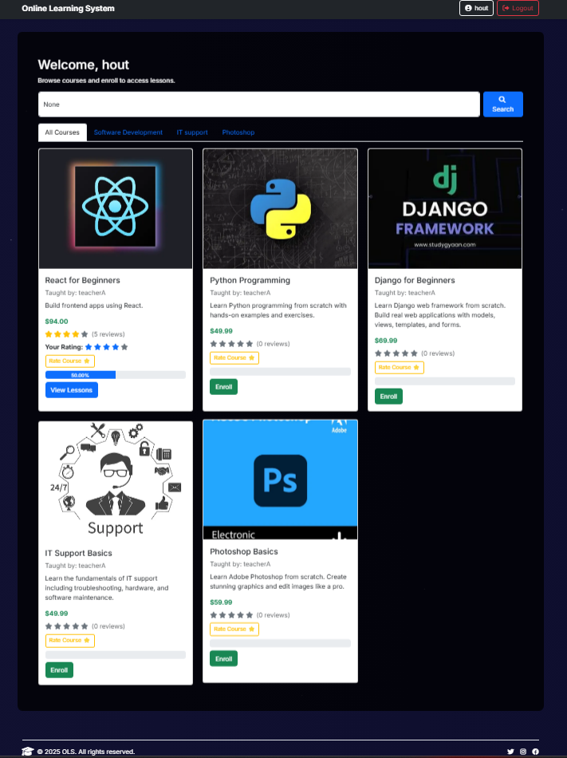
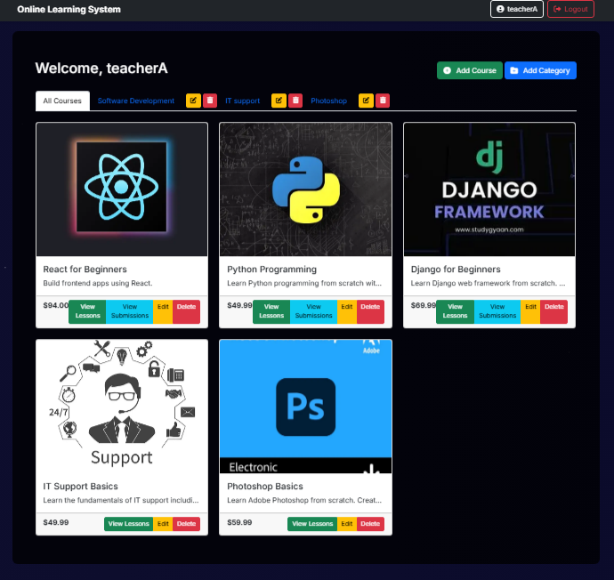
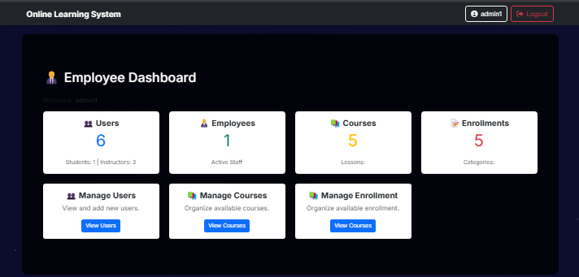
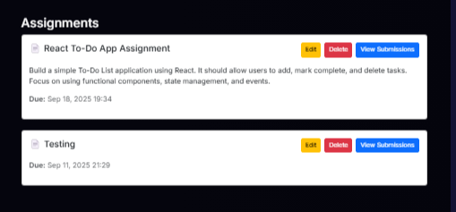
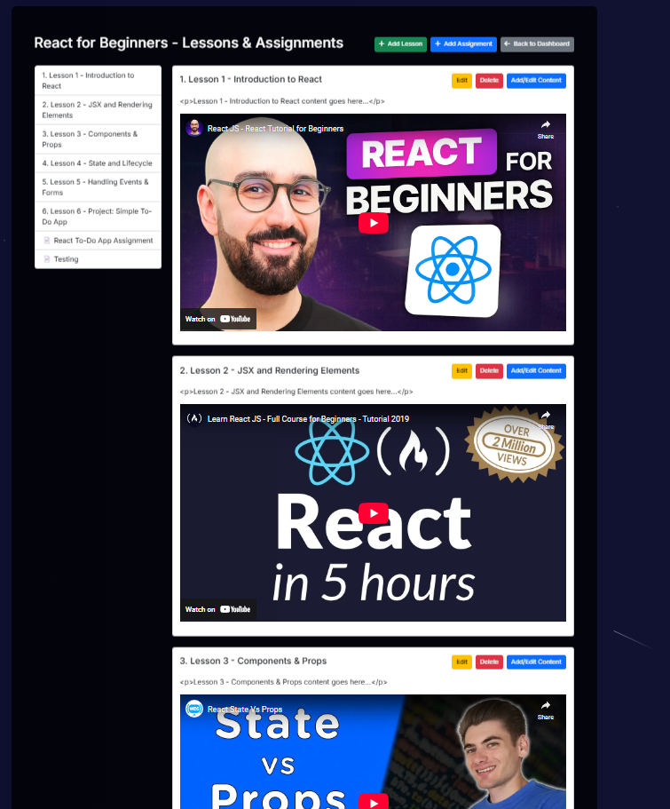

# 🧠 Online Learning System

A role-based learning platform built with **Django** that allows students to enroll in courses, instructors to manage content, and admins to oversee the system.

There room that can improve and implement in the future.

---

## ✨ Features

### 👩‍🎓 Students
- Browse and enroll in courses by category
- Access lessons and learning content
- Submit assignments and receive grades
- Post and read course reviews

### 👨‍🏫 Instructors
- Create and manage courses and lessons
- Upload lesson content (video, documents)
- Create assignments and grade submissions
- View enrolled students

### 🧑‍💼 Admins
- Manage all users, courses, and categories
- Oversee system data and user roles

---

## 🖼 Screenshots

<table> <tr> <td align="center"> <b>Login</b><br>  </td> <td align="center"> <b>Student Dashboard</b><br>  </td> </tr> <tr> <td align="center"> <b>Instructor Dashboard</b><br>  </td> <td align="center"> <b>Employee Dashboard</b><br>  </td> </tr> <tr> <td align="center"> <b>Assignment</b><br>  </td> <td align="center"> <b>Lesson Content</b><br>  </td> </tr> </table>

---
| Role       | Username   | Password         |
| ---------- | ---------- | ---------------- |
| Student    | `hout`     | `pass123456`     |
| Instructor | `teacherA` | *(set manually)* |
| Employee   | `admin1`   | *(set manually)* |
| Admin      | `admin `   | `123456`         |


## ⚙️ Setup Instructions
```bash
### 1. Clone the Repository

git clone https://github.com/HoutWill/Online-Learning-System.git
cd Online-Learning-System

2. Create a Virtual Environment

    python -m venv venv
    source venv/Scripts/activate  # On Windows
   
3. pip install -r requirements.txt

4. python manage.py migrate
   python manage.py runserver
   Then open http://127.0.0.1:8000 in your browser.

5. Online-Learning-System/
├── accounts/
├── courses/
├── lessons/
├── assignments/
├── templates/
├── static/
├── screenshots/
└── manage.py

| Role       | Access Rights                           |
| ---------- | --------------------------------------- |
| Student    | View/enroll courses, submit assignments |
| Instructor | Create/manage courses and lessons       |
| Admin      | Full control over system                |


📌 Notes

Default database is SQLite — switch to PostgreSQL or MySQL by editing settings.py.

Ensure DEBUG=True only during development.

Use the createsuperuser command to access the Django admin panel.


